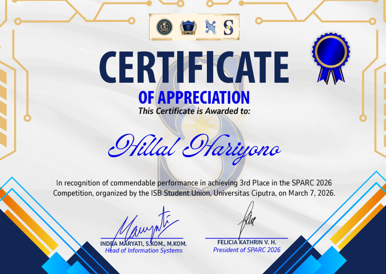
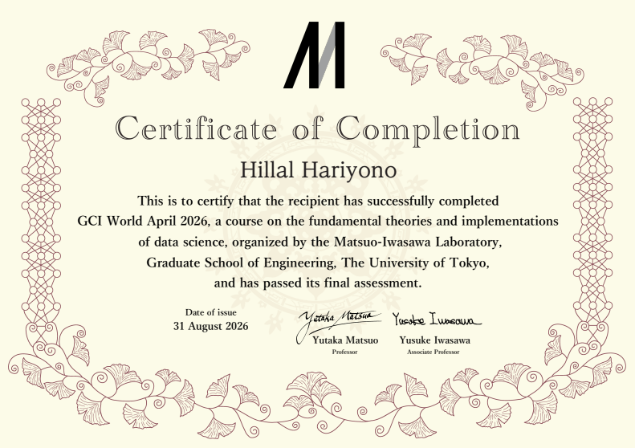
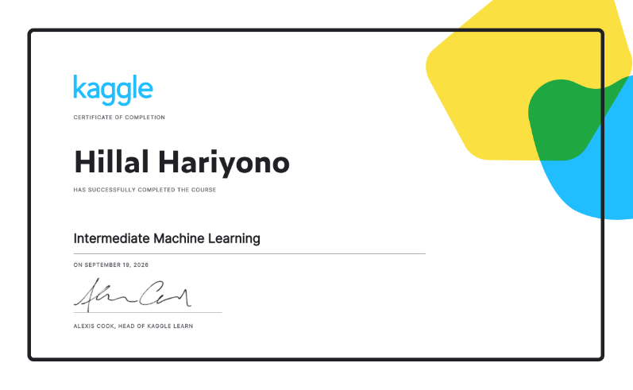
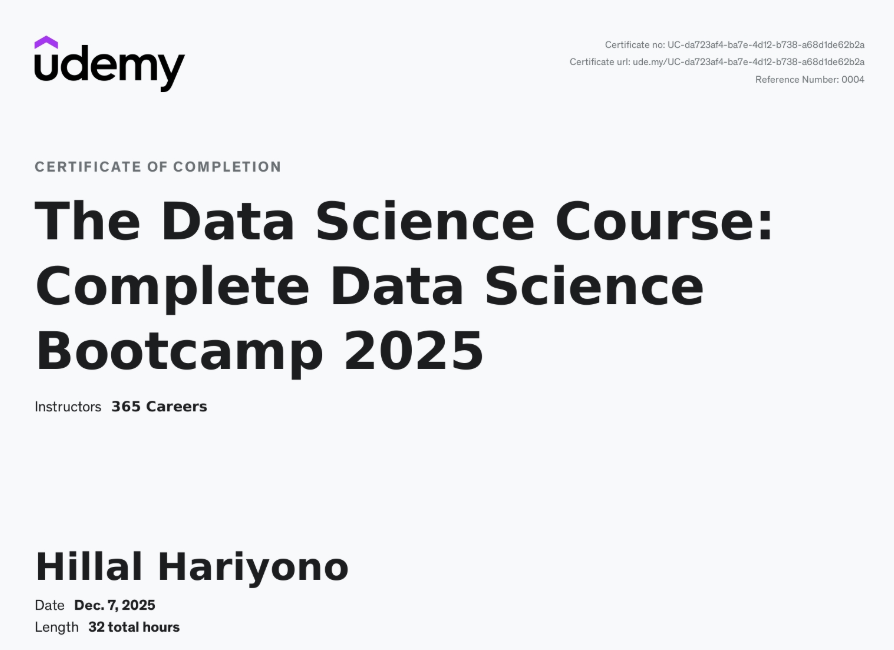

 

 

## 🧭 Tentang Saya

> Mengeksplorasi pola dari data mentah, mengujinya secara statistik, sampai membangun model yang benar-benar bisa dipakai di dunia nyata.

Mahasiswa Sains Data di **BINUS University** (IPK 3.80/4.00), berlatar belakang Teknik Komputer dan Jaringan. Mengimplementasikan pendekatan mulai dari pemodelan klasik (XGBoost, ensemble stacking) hingga deep learning (CNN, transfer learning, transformer), sampai deployment ke production (FastAPI, Streamlit, AWS SageMaker) — banyak diasah lewat kompetisi data science nasional & internasional.

<table>
<tr>
<td width="50%" valign="top">

**📍 Saat Ini**
- Research Division Staff — *Data Science Club BINUS University*
- Anggota Tim Kompetisi — *Data Seeker Data Science Competition*

</td>
<td width="50%" valign="top">

**🕘 Pengalaman & Volunteering**
- Technical Support Staff — *PT Gayuh Media Informatika*
- Student Teaching Assistant — *Teach For Indonesia*

</td>
</tr>
</table>

 

## 🛠️ Tech Stack

**Bahasa & Tools**
 

  

**Machine Learning & Deep Learning**
 

  

**Deployment & Cloud**
 

 

## 🏅 Sorotan Kompetisi & Proyek

<table>
<tr><th align="left">Proyek</th><th align="left">Konteks</th><th align="left">Temuan Utama</th></tr>

<tr><td>🥉 <b>Prediksi Pelanggan Beli Ulang — Dealer Motor</b></td><td>Juara 3, UC SPARC 2026 (Univ. Ciputra)</td><td>Model menemukan <b>62%</b> pelanggan yang akan beli ulang. Pelanggan dengan hasil score model tertinggi <b>2,08x lebih sering</b> beli ulang dari rata-rata, jadi promosi lebih tepat sasaran. (XGBoost, Recall 0.62, ROC-AUC 0.7056, lift 2.08x, Kaplan-Meier & Cox PH)</td></tr>

<tr><td><b>Klaim & Forecasting Asuransi Kesehatan</b></td><td>DSC MCF ITB</td><td>Tebakan biaya klaim meleset rata-rata <b>Rp38,28 juta</b>, dan <b>60%</b> peserta yang klaim berhasil dikenali. Cocok untuk memprioritaskan kasus, bukan keputusan tunggal. (Random Forest MAE Rp38.28 Jt, Recall 0.60, 4.627 klaim)</td></tr>

<tr><td><b>Analisis Beban Layanan Kesehatan — Stormont Vail</b></td><td>ASA DataFest 2026 — Tim Immortal</td><td>Pasien dengan hambatan sosial punya peluang ke IGD <b>4,57x lebih tinggi</b>. Jadi beban IGD tidak hanya soal medis. (Regresi logistik, 359.760 pasien, p&lt;0.001)</td></tr>

<tr><td><b>Penilaian Risiko Gagal Bayar Kredit</b></td><td>Kaggle — Home Credit Default Risk</td><td>Model memberi skor risiko lebih tinggi pada peminjam gagal bayar di sekitar <b>78%</b> pasangan kasus. Daya bedanya tergolong baik untuk scoring kredit. (Stacking XGBoost+LightGBM+CatBoost, ROC-AUC 0.7821, KS 0.4266)</td></tr>

<tr><td><b>Sistem ML dari Data hingga Bisa Dipakai</b></td><td>Ujian Akhir Semester</td><td>Model tidak berhenti di notebook, tetapi sudah bisa dipakai lewat aplikasi web dan cloud. (F1-macro 0.706, pipeline OOP, FastAPI, Streamlit, AWS SageMaker)</td></tr>

<tr><td><b>Klasifikasi Otomatis Citra Bencana</b></td><td>Deep Learning Project</td><td>Model tetap adil pada jenis bencana yang jarang muncul, meski datanya sangat timpang. Skor keseimbangannya <b>0,81</b>. (MobileNetV2 + class weights, Macro F1 0.81)</td></tr>

<tr><td><b>Analisis Sentimen Tweet</b></td><td>NLP Project</td><td>Model bahasa modern lebih akurat <b>5,1 poin</b> dari metode hitung kata. Ia memahami konteks kalimat, bukan sekadar kata. (DistilBERT, Macro-F1 0.8643 vs baseline TF-IDF)</td></tr>

<tr><td><b>Segmentasi Pelanggan & Strategi Pemasaran</b></td><td>Project</td><td>Pelanggan terbagi ke kelompok dengan perilaku mirip, sehingga strategi pemasaran bisa dibedakan. Batas antar kelompok cukup moderat. (K-Means + PCA, Silhouette 0.4058)</td></tr>
</table>

 

## 📜 Sertifikat & Penghargaan

<table>
  <tr>
    <td align="center" width="50%">
      
       
      <b>🥉 3rd Place — UC SPARC 2026</b> ISB Student Union, Universitas Ciputra
    </td>
    <td align="center" width="50%">
      
       
      <b>🗼 GCI World April 2026</b> Matsuo-Iwasawa Laboratory, The University of Tokyo
    </td>
  </tr>
  <tr>
    <td align="center" width="50%">
      
       
      <b>Intermediate Machine Learning</b> Kaggle Learn
    </td>
    <td align="center" width="50%">
      
       
      <b>The Data Science Course: Complete Bootcamp 2025</b> Udemy (365 Careers)
    </td>
  </tr>
</table>

 

<i>📫 Selalu terbuka untuk kolaborasi proyek data science — hubungi lewat email atau LinkedIn di atas!</i>

